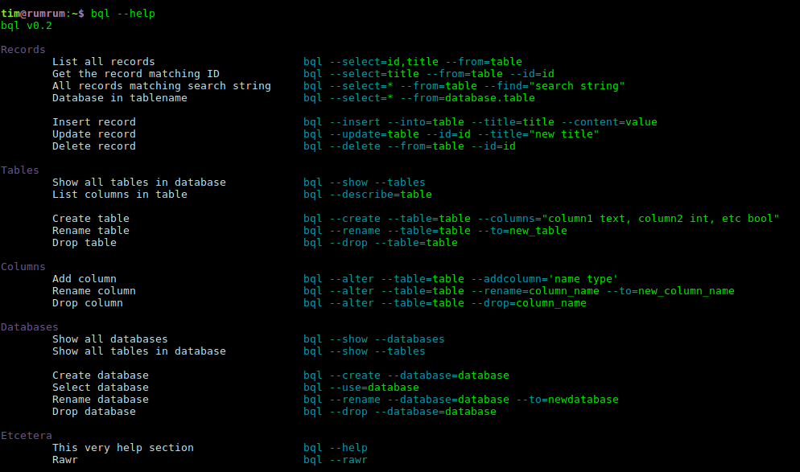

BashQL (Bash Query Language) is a database management system (dbms) and database engine rolled into one. Very quick setup and transparent: databases are set up locally in the BashQL install directory. Easy to back up and ship elsewhere.

Note: It's a work in progress, keep in mind that the storage format can still change.
The nightly build is dark and full of terrors.


## Features
	* SQL-like syntax on the commandline, like:
		* --show --databases
		* --show --tables
		* --describe=<table_name>
		* --select=* --from=<table_name> --id=<id>
	* Runs completely on bash
	* Output can be JSON or a table format
	* Only three dependencies: grep, awk and jq.
	* Create/update/drop databases and tables
	* Insert / update / delete records
	* Supports search and fetch by ID


## Dependencies

	* awk
	* grep
	* jq (for json support)


## Get started

```bash

# Pull repo
git pull git@github.com:koffiebaard/ish.git

# install (== put symlinks in ~/.local/bin, check dependencies)
./install.sh

# source your profile for autocomplete to work
source ~/.bash_profile

# Confirm everything works
bql --test

# Check again, just to be sure
bql --rawr
```


## Documentation

The help function is up to date:




## Examples

```bash

# Create database
$ bql --create --database=test
OK

# Select database
$ bql --use=test
OK

# Create table
$ bql --create --table=tabletest --columns='table text, chair text, awesome int'
OK

# Show table info (incorrect table name)
$ bql --describe=tabletesTTT
Error: Table "tabletesTTT" does not exist.

# Show table info (incorrect database name)
$ bql --describe=cake.tabletest
Fatal: Database "cake" doesn't exist.

# Show table info (default is json)
$ bql --describe=tabletest
[
  {
    "name": "id",
    "type": "text"
  },
  {
    "name": "table",
    "type": "text"
  },
  {
    "name": "chair",
    "type": "text"
  },
  {
    "name": "awesome",
    "type": "int"
  }
]

# Show table info (in table format)
$ bql --describe=tabletest --tabular

| name         | type
=======================
| id           | text
| table        | text
| chair        | text
| awesome      | int

# Insert record into table
$ bql --insert --into=tabletest --table="Flattened oak tree" --chair="Unflattened pine blob" --awesome=9001
15c0a959-4167-474b-b963-79f17a1f0713

# select from table, in table format
$ bql --select=* --from=tabletest --tabular

| awesome      | chair                      | id                                        | table
==========================================================================================================
| 9001         | unflattened pine blob      | 15c0a959-4167-474b-b963-79f17a1f0713      | Flattened oak tree

```


## Contributing

Feel free to contribute! Ping me or send a pull request and let's go.


## License

BashQL is under the MIT license, but without me shipping the copyright text with the project. That's too much effort.
